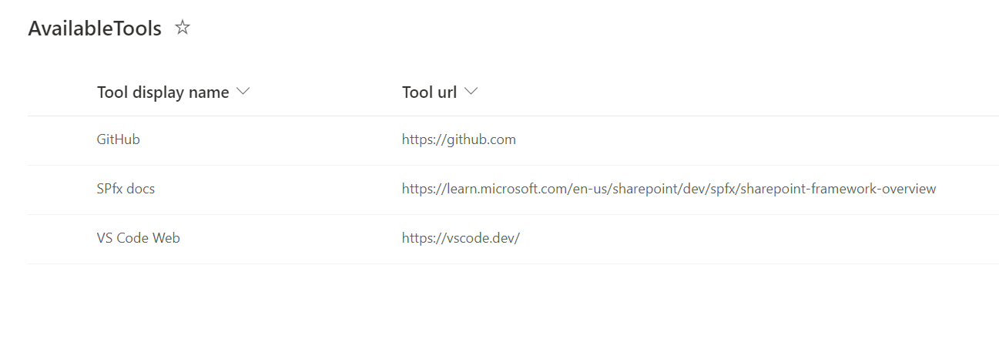
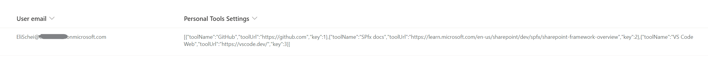
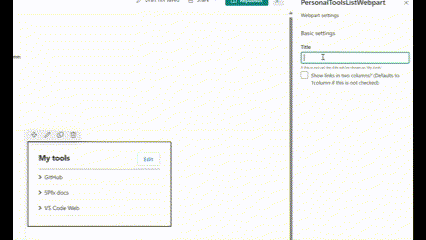

# Personal tools list

## Summary
Allows users to select tools from a predefined list and save them in their own personalized view.
This webpart has the fundamental functionallity - a great starting point to build upon if you need something more advanced.

The available tools are added to a list


And the user can select from this list what link(s) he/she wants to be displayed for them.


The webpart saves to another list..


The webpart title can be changed from the property pane, here you can also select to display the tools in two columns (defaults to 1 column if this is not selected)



## Solution
Using SPfx 

| Solution    | Author(s)                                               |
| ----------- | ------------------------------------------------------- |
| SPFX-react-my-tools-webpart | [Eli H. Schei ](https://acupof.dev) |

## Version history

| Version | Date             | Comments        |
| ------- | ---------------- | --------------- |
| 1.0     | February 08, 2024 | Initial release |


## Minimal Path to Awesome
### Prerequisites
> You need to run the script in the env-setup folder to create the content types and lists used in the code. If you create them manually you might need to change the code to use the correct list and field names.

### Running the code locally
> If you need an environment for development and/or testing --> Get your own free development tenant by subscribing to [Microsoft 365 developer program](http://aka.ms/o365devprogram)
- Clone this repository
- Run the script in the "env-setup" folder ([you need pnp-poweshell to run this](https://pnp.github.io/powershell/))
- In your CLI navigate to thesolution folder (the folder where this readme file lives)
- in the command-line run:
  - **npm install**
  - **gulp serve**

### Package and deploy webpart
[Here is a blogpost that takes you through every step](https://elischei.com/deploy-your-spfx-solution-using-pnp-powershell/)
#### Package
First you need to package the solution for production
```powershell
gulp build
gulp bundle --ship
gulp package-solution --ship
```
Then you can upload the sppkg to your appcatalog manually, or using PnP powershell as shown below. 
```powershell
Connect-PnPOnline "appcatalogurl" -Interactive

$appCatConnection = Connect-PnPOnline $appcatalog -ReturnConnection -Interactive

Add-PnPApp -Path "./project-wp.sppkg" -Connection $appCatConnection -Publish -SkipFeatureDeployment -Overwrite
```

## Disclaimer

**THIS CODE IS PROVIDED _AS IS_ WITHOUT WARRANTY OF ANY KIND, EITHER EXPRESS OR IMPLIED, INCLUDING ANY IMPLIED WARRANTIES OF FITNESS FOR A PARTICULAR PURPOSE, MERCHANTABILITY, OR NON-INFRINGEMENT.**

---